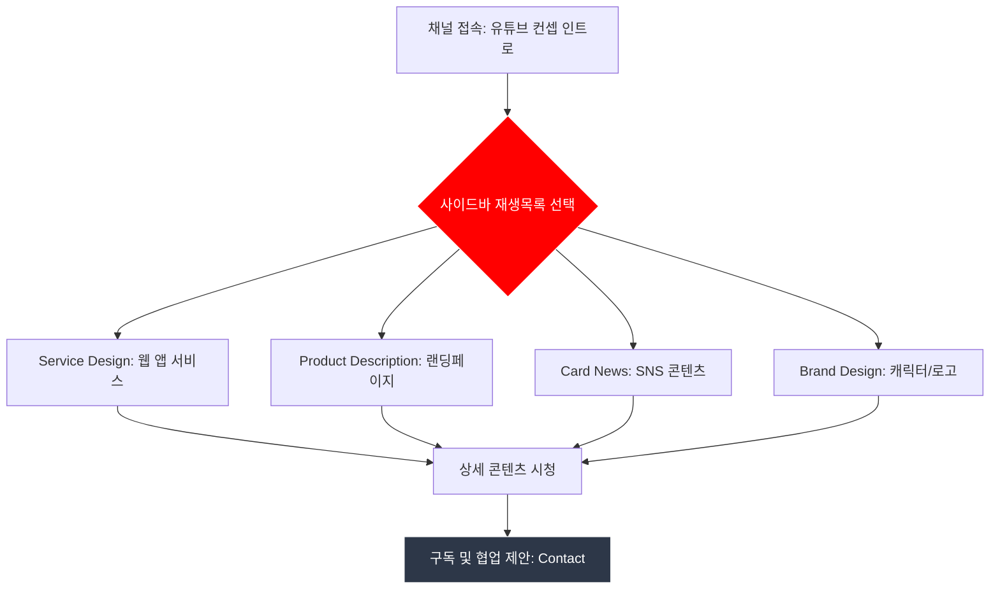

# 📺 [Your Name]’s Dev-Log: Creative Streaming

> **"나의 역량을 플레이(Play)하다."**
> **유튜브 인터페이스를 모티프로 설계된, 디자인과 개발의 경계를 허무는 '콘텐츠형' 포트폴리오 웹사이트입니다.**

---

## 🔗 채널 바로가기 (Links)

| 구분           | 링크                                                                                                                                 |
| -------------- | ------------------------------------------------------------------------------------------------------------------------------------ |
| **LIVE Demo**  | [포트폴리오 배포 주소]                                                                                                               |
| **Repository** | [github.com/kny45112003-hue/portfolio-website](https://www.google.com/search?q=https://github.com/kny45112003-hue/portfolio-website) |

---

## 🎞️ 재생목록 (Contents Categories)

유튜브 채널의 카테고리처럼, 저의 모든 작업물을 4가지 전문 영역으로 분류하여 구성했습니다.

### 1. 🌐 Service Design

- **홈페이지 및 웹 앱 서비스**
- 프로젝트의 사용자 여정과 비즈니스 로직을 설계한 결과물입니다. (예: Dishly AI, 대구 트립로드 리디자인 등)

### 2. 📝 Product Description

- **상세페이지 및 랜딩페이지**
- 제품의 가치를 시각화하고 구매/참여를 유도하는 목적 지향적 디자인 페이지입니다.

### 3. 📱 Card News

- **SNS 카드뉴스 디자인**
- SNS 환경에 최적화된 짧고 강렬한 정보 전달형 비주얼 콘텐츠입니다.

### 4. ✨ Brand Design

- **브랜드 아이덴티티 및 그래픽**
- 로고, 캐릭터(햄스터 등), 브랜드 컬러 시스템을 구축하여 고유의 정체성을 부여한 프로젝트입니다.

---

## 🛠 채널 운영 기술 (Tech Stack)

### Broadcast Tools (Design)

### Transmission (Frontend)

---

## 🔄 탐색 흐름 (User Journey)

방문자가 저의 포트폴리오 채널을 시청하는 흐름입니다.



---

## 🎨 주요 UX 설계 포인트

- **Video-Player UI**: 메인 프로젝트를 비디오 플레이어 화면처럼 배치하여 '시청'하는 경험 선사
- **Category Navigation**: 사이드바를 통해 4가지 핵심 구역(Service, Product, Card, Brand)으로 빠른 이동 가능
- **Visual Asset**: 직접 제작한 일러스트 에셋을 활용하여 독창적인 채널 브랜딩 구축

---

## 📂 채널 구성 (Directory Structure)

```text
src/
├── assets/             # 채널 그래픽 에셋 (캐릭터, 썸네일)
├── components/         # 유튜브 UI 조각 (TopNav, SideMenu, Player)
├── sections/           # 4가지 메인 구역 (Service, Product, Card, Brand)
└── styles/             # 유튜브 감성의 다크/라이트 테마 설정

```

---

## 📢 Ending Credit

- **"저의 창의적인 스트리밍을 시청해주셔서 감사합니다. 함께 가치 있는 콘텐츠를 만들어가고 싶습니다."**
- **Contact**: [본인의 이메일]
- **GitHub**: `github.com/kny45112003-hue`
